# Welcome to your CDK TypeScript project

You should explore the contents of this project. 
The `cdk.json` file tells the CDK Toolkit how to execute your app.

## Prerequisites
* AWS Account: prepare your personal AWS Account through
* AWS CDK CLI: The AWS CDK Toolkit, the CLI command cdk , is the primary tool for interacting with your AWS CDK app.
In this project root directory, execute the following commands:
* `npn install`
* `cdk bootstrap` This command is optional. If this is the first deployment in your Account/Region through CDK, you must execute once at the first time.

## Set up environment
Before to start cdk application, you need to set up your environment variable.
* Update your account and region information in configuration file.
* [project]/config/app-config-dev.json
```
    "Project": {
        "Name": "SonarqubeCdk",
        "Stage": "Dev",
        "Account": "[Your account number]",
        "Region": "[Region]",
        "Profile": "[AWS Credential Profile]"
    },
```
* Set configuration files
```
export APP_CONFIG=config/app-config-xxx.json
```
* In order to list the stacks in a CDK application we have to use the cdk list command `cdk list`
```
❯ cdk list
==> CDK App-Config File is config/app-config-dev.json, which is from Environment-Variable.
SonarqubeCdkDev-DevRepoStack
SonarqubeCdkDev-DevSecOpsStack
SonarqubeCdkDev-SonarQubeStack
SonarqubeCdkDev-VpcInfraStack
```

## CDK Deployment Steps
### Infrastructure
* First of all, we need to deploy a repository stack. Because the repository will trigger next step in the pipeline.
```cdk deploy SonarqubeCdkDev-VpcInfraStack```
* Deploy the repository stack to store source code. 
`cdk deploy SonarqubeCdkDev-DevRepoStack`

### Sonarqube
* Deploy the SonqrQube stack
`cdk deploy SonarqubeCdkDev-SonarQubeStack`
* You can find out the SonarQube endpoint in `Outputs` field.
```
SonarqubeCdkDev-SonarQubeStack.SonarQubeOutputSonarqubeAPIEndpointxxxxx = http://Sonar-Sonar-xxxx.ap-northeast-2.elb.amazonaws.com
SonarqubeCdkDev-SonarQubeStack.SonarQubesonarqubeserviceLoadBalancerDNSxxxxx = Sonar-Sonar-xxxxx.ap-northeast-2.elb.amazonaws.com
SonarqubeCdkDev-SonarQubeStack.SonarQubesonarqubeserviceServiceURLxxxxx = http://Sonar-Sonar-xxxxx.ap-northeast-2.elb.amazonaws.com
```
* Let's move to the SonarQube app to login Sonarqube website. The default account is `admin/admin`.
    > [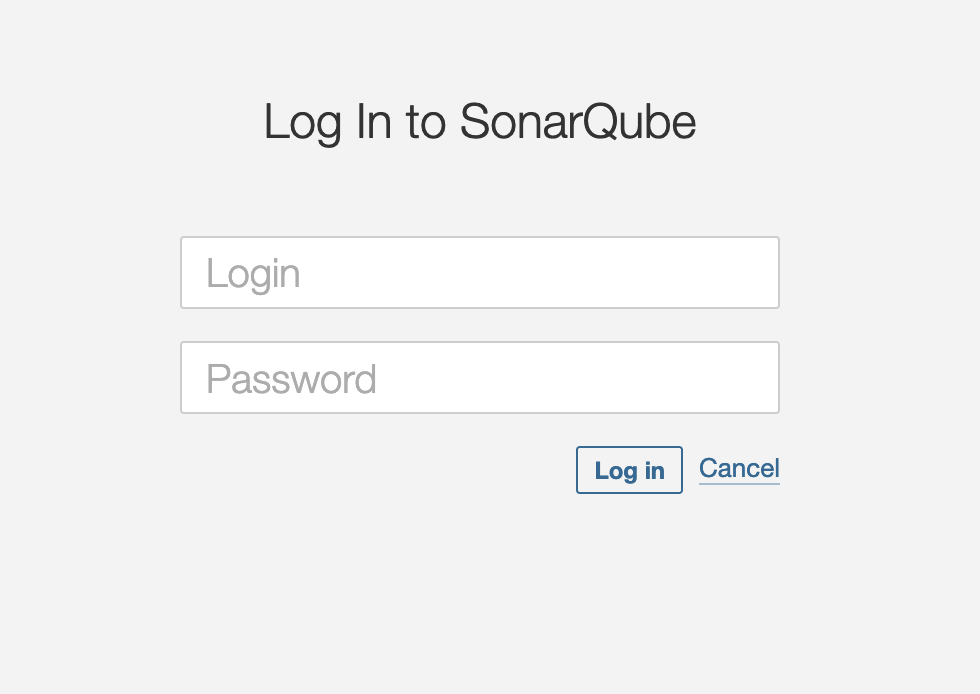](doc/sonarqube01.png)

* Update your password of administrator account.
    > [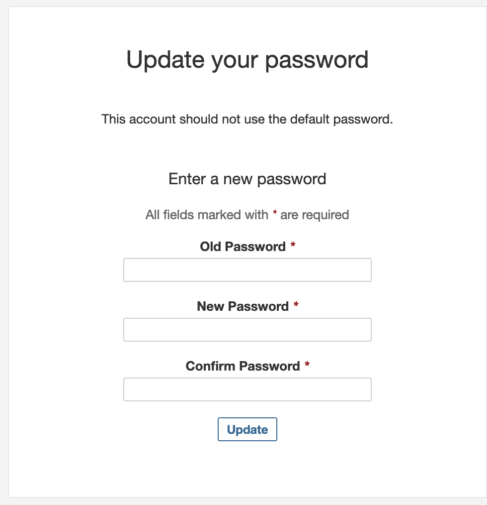](doc/sonar-new-password.png)

* Click `My Account` menu in **`A`** button that is on the top right corner.
    > [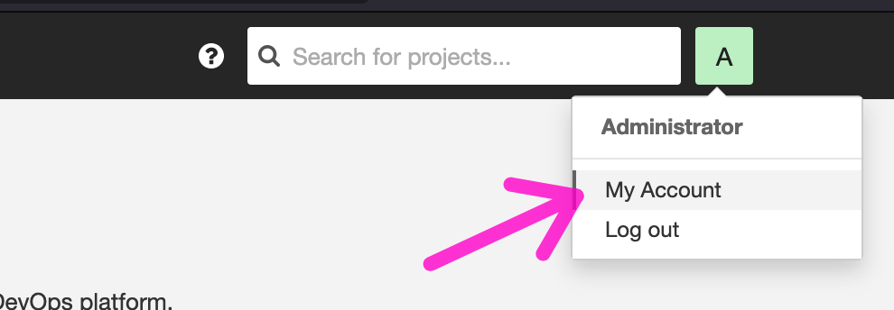](doc/menu-account-setting.png)

* Click `Security` tab on the top menu.
    > [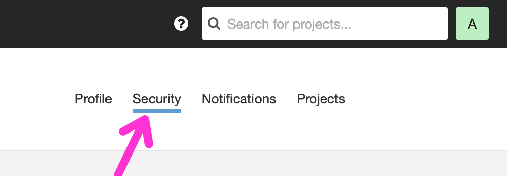](doc/admin-security.png)   

* To Generate token, fill in the `Input Name`, `Type`, `Expires in` and click `Generate` button.
    > [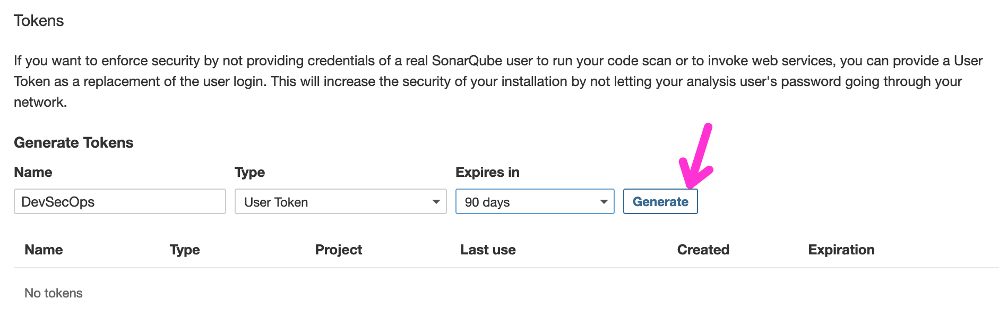](doc/create-token.png)  

* Click `Copy` button to store the Key value into your clipboard.
    > [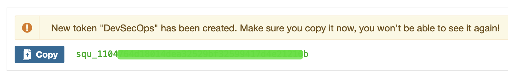](doc/copy-button.png)  

* Click `Administrator` menu on the top menu.
* Click `Projects` tab and `Create Project` button.
    > [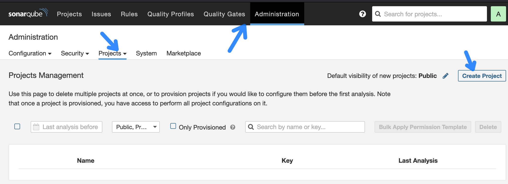](doc/create-project.png) 
* Fill out the form with your application information.
    > [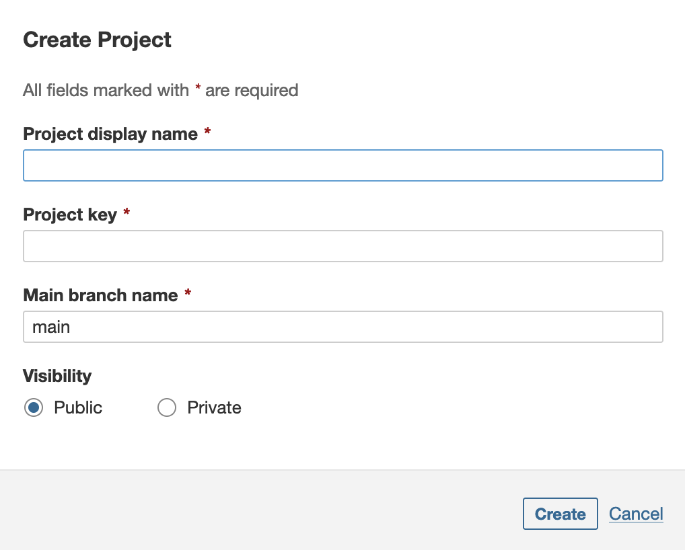](doc/project-info.png)

### Set up AWS Secret Manger
We can use token value with AWS Secret Manager for security.

Secrets Manager enables you to replace hardcoded credentials in your code, including passwords, with an API call to Secrets Manager to retrieve the secret programmatically. This helps ensure the secret can't be compromised by someone examining your code, because the secret no longer exists in the code. Also, you can configure Secrets Manager to automatically rotate the secret for you according to a specified schedule. This enables you to replace long-term secrets with short-term ones, significantly reducing the risk of compromise.
* Open your AWS Console and move to [AWS Secret Manager](https://console.aws.amazon.com/secretsmanager) console.

* Click a `Store a new secret` button.
    > [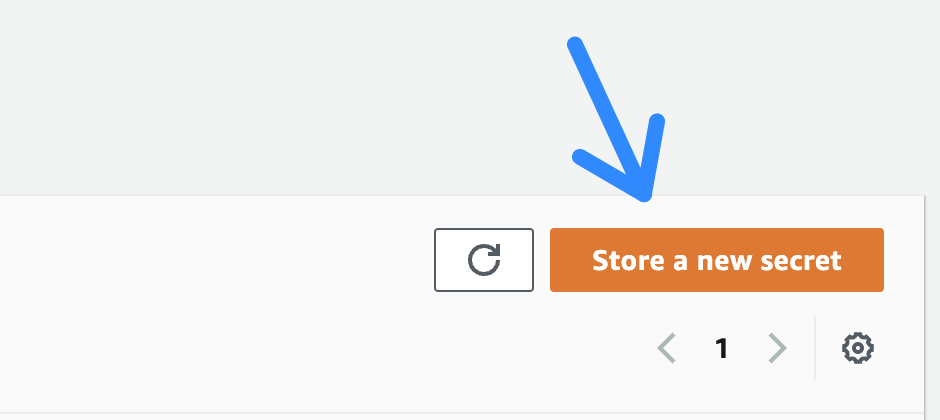](doc/click-store-key.png)  

* Choose `Security type` is `Other type of secret` and clike `Plaintext` tab on `Key/value pairs`. Paste `key` value from what you generate key before in SonarQube.
    > [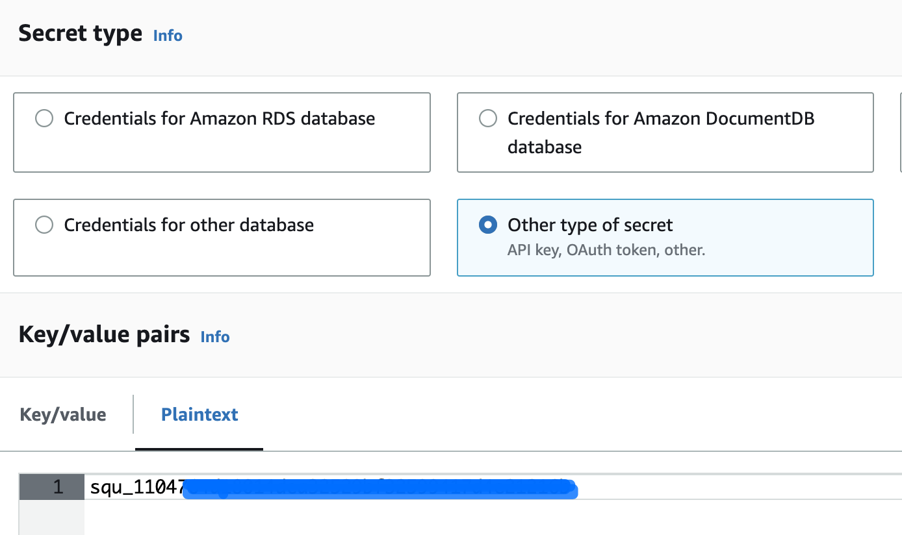](doc/secret-value.png)  
* Click `Next` button on the bottom of the page.
* Fill in the `Secret name`
    > [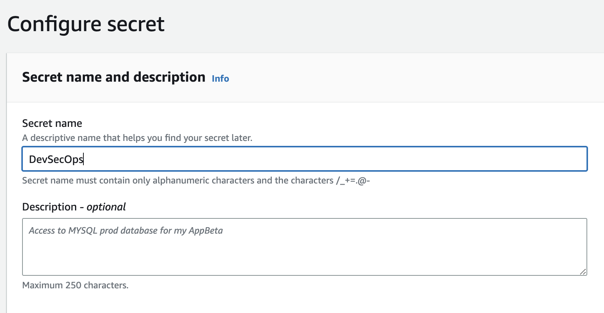](doc/secret-name.png)  
* Click `Next` button on the bottom of the page.
* Click `Next` button on the bottom of the page. To skip the Configure rotation - optional page.
* Review the page and click 'Store' button on the bottom of the page.
* Now, you can find out the Secret value from the list.
    > [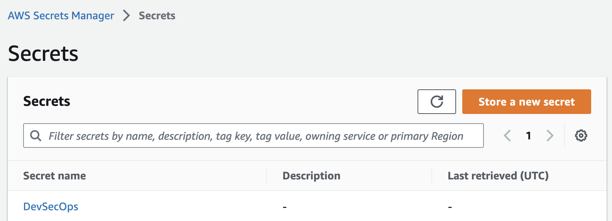](doc/secret-list.png)  
* Click link of`Secret name` on the list
* Copy `Secret ARN` to use.
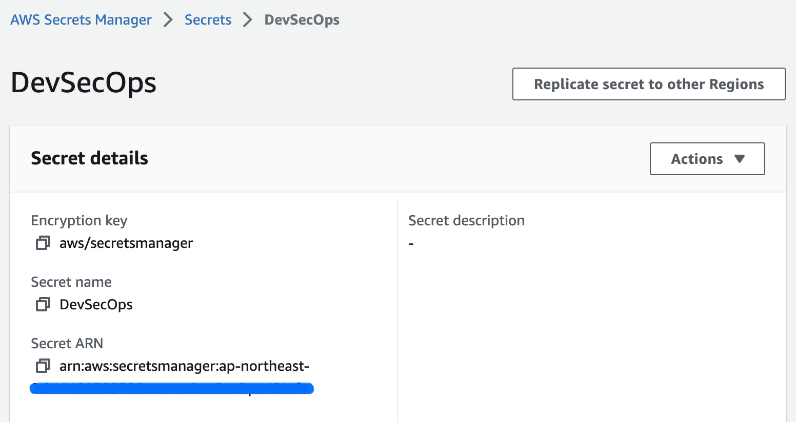  

### Update secret information in your code
* Open your configuration file on your CDK project and update `SONAR_PROJECT_KEY` and `SONAR_TOKEN_ARN`.
* [project]/config/app-config-dev.json
```
    "DevSecOps": {
        "Name": "DevSecOpsStack",
        "SonarQube": {
            "SONAR_PROJECT_KEY":"[your project key]",
            "SONAR_TOKEN_ARN":"arn:aws:secretsmanager:[region]:[account number]:secret:[secret key]"
        }
    },
```
 
* Deploy `DevSecOps` stack
```
cdk deploy SonarqubeCdkDev-DevSecOpsStack
```

### SonarQube integrate AWS CodeCommit
* Open AWS Console and move to [AWS CodeCommit](https://aws.amazon.com/codesuite/codecommit/repositories) console.
* Click your repository what you create with this CDK project.
    > [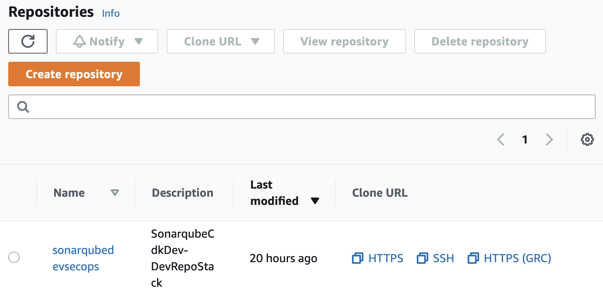](doc/coderepo-list.png)  

* Copy the repository url to clone it.
    > [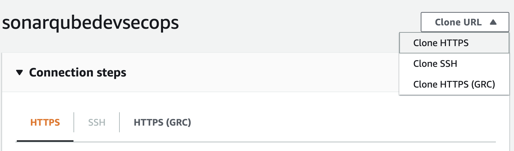](doc/repo-info.png)  

* Clone the repository on your console.
```
git clone https://git-codecommit.xxxx.amazonaws.com/v1/repos/sonarqubedevsecops
```

* Commit and push to your remote repository after you finish your coding.

* Check your code status on your SonarQube website.

* Congrats! Now you can check your code `QUALITY` automatically.
    > [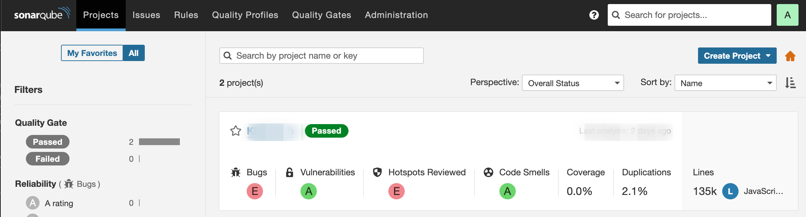](doc/project-list.png)  

## References
* [AWS CDK Template for DevOps](https://github.com/aws-samples/aws-cdk-project-template-for-devops)
* [SonarQube on AWS using CDK](https://github.com/drskur/sonarqube-on-aws-using-cdk)